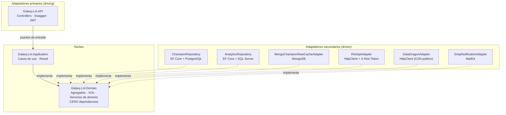
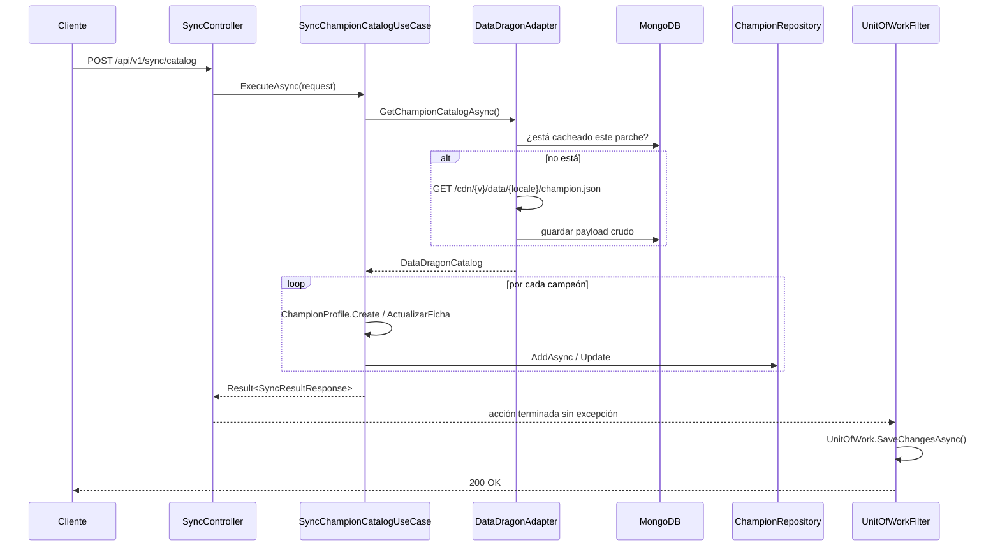
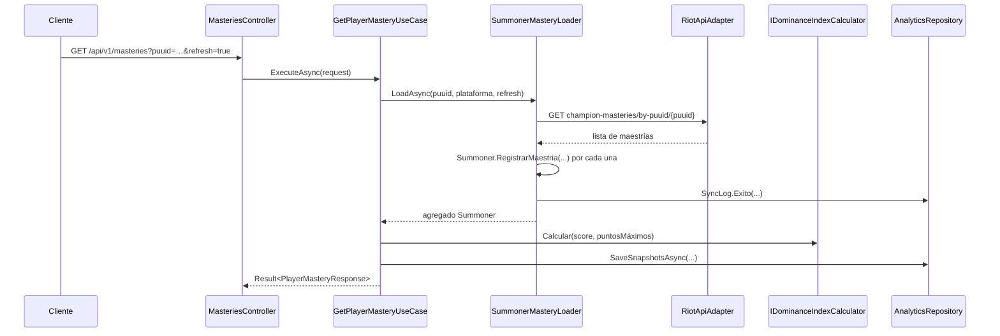
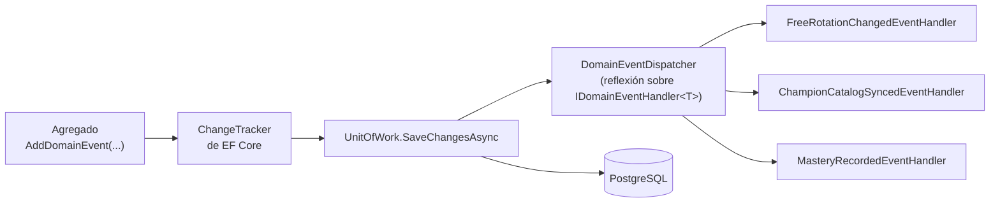
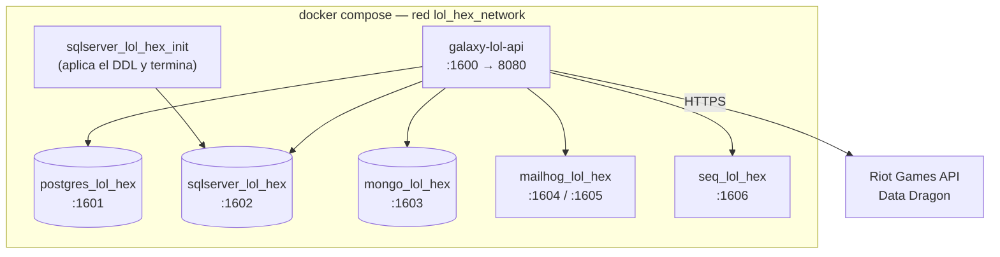

# Arquitectura — Hexagonal (Ports & Adapters)

## 1. El hexágono

Las flechas punteadas son **inversión de dependencias**: los adaptadores dependen
de las interfaces que declara el dominio, nunca al revés. El compilador lo
garantiza: `Galaxy.Lol.Domain.csproj` no tiene un solo `PackageReference` ni
`ProjectReference`.

## 2. Puertos declarados

| Puerto | Tipo | Adaptador |
|---|---|---|
| `IChampionRepositoryPort` | salida — persistencia SQL | `ChampionRepository` (PostgreSQL) |
| `IFreeRotationRepositoryPort` | salida — persistencia SQL | `FreeRotationRepository` (PostgreSQL) |
| `ISummonerRepositoryPort` | salida — persistencia SQL | `SummonerRepository` (PostgreSQL) |
| `IAnalyticsRepositoryPort` | salida — persistencia SQL | `AnalyticsRepository` (SQL Server) |
| `IChampionRawCachePort` | salida — persistencia NoSQL | `MongoChampionRawCacheAdapter` |
| `IRiotApiPort` | salida — REST | `RiotApiAdapter` |
| `IDataDragonPort` | salida — REST | `DataDragonAdapter` |
| `INotificationPort` | salida — mensajería | `SmtpNotificationAdapter` |
| `IUnitOfWork` | salida — transaccional | `UnitOfWork` + `UnitOfWorkFilter` |
| `IGet*UseCase` / `ISync*UseCase` | entrada | los controladores |

## 3. Sincronización del catálogo

El caso de uso **no llama a `SaveChanges`**. La transacción la cierra el filtro,
que es lo que mantiene la gestión transaccional fuera de la lógica de negocio.

## 4. Consulta de maestría con recálculo del índice de dominio

Si Riot falla pero ya había datos locales, `SummonerMasteryLoader` devuelve lo
guardado en vez de romper la consulta, y deja el fallo registrado en la bitácora.

## 5. Flujo de eventos de dominio

Los eventos se despachan **antes** del `SaveChanges` para que, si un manejador
modifica el modelo, ese cambio entre en la misma transacción. Un manejador que
falle se registra pero no tumba el guardado: el hecho ya ocurrió.

## 6. Despliegue

Los tres entregables usan rangos de puerto distintos (15xx / 16xx / 17xx) para
poder levantarse en paralelo.

## 7. Qué gana y qué cuesta esta arquitectura aquí

**Gana**: los casos de uso se prueban sin base de datos ni red — `ChampionUseCaseTests`
solo necesita `Mock<IChampionRepositoryPort>`. Cambiar PostgreSQL por otro motor,
o Mongo por Redis, toca un archivo de `Adapters/` y una línea de `DependencyInjections`.

**Cuesta**: hay más indirección que en la versión en capas. Una consulta simple
atraviesa controlador → caso de uso → puerto → adaptador → EF Core, y los modelos
externos de Riot se declaran dos veces (el `record` privado del adaptador y el
contrato del dominio). Es el precio de que el núcleo no sepa qué forma tiene el
JSON de Riot.
