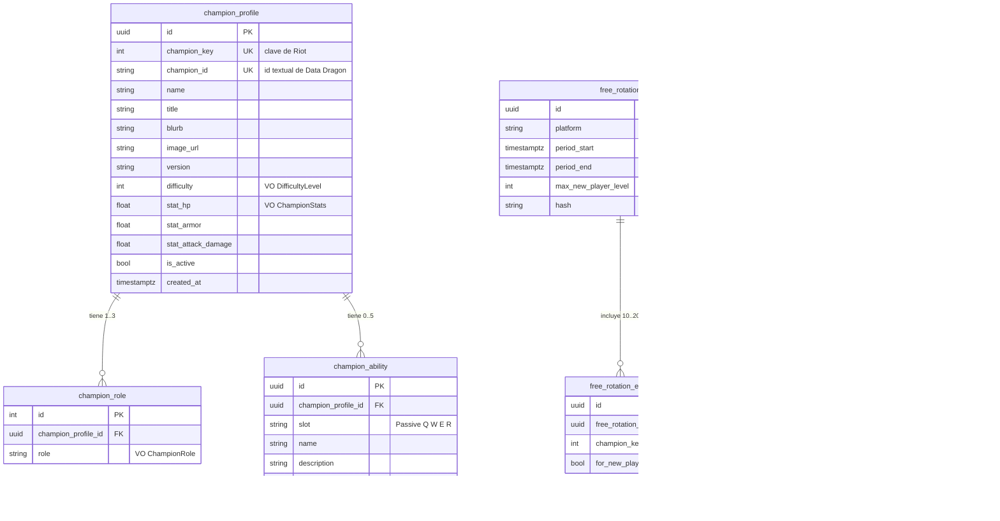
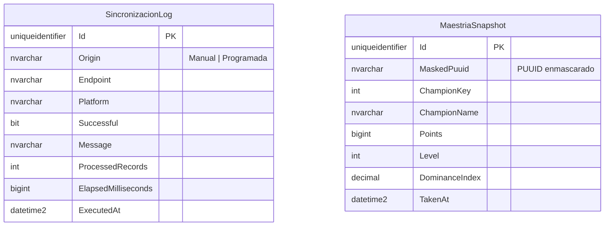

# Modelo de datos

Tres motores, cada uno por una razón distinta.

## 1. PostgreSQL — `bdchampions` (esquema `champions`)

Base transaccional del explorador. Siete tablas relacionadas.



### Justificación de las cardinalidades

- **`champion_profile` 1—N `champion_role`**: Data Dragon entrega los roles como
  una lista (`tags`) de uno a tres elementos, en orden de relevancia. El primero
  es el rol principal. Es una colección de objetos de valor, mapeada con
  `OwnsMany`: no tiene identidad propia fuera del campeón.
- **`champion_profile` 1—N `champion_ability`**: pasiva más Q, W, E y R. Se
  reemplazan en bloque en cada sincronización del detalle.
- **`free_rotation` 1—N `free_rotation_entry`**: cada rotación semanal guarda
  entre 10 y 20 campeones, más la lista aparte para cuentas nuevas
  (`for_new_players`).
- **`summoner` 1—N `champion_mastery`**: una fila por campeón jugado. El índice
  único `(summoner_id, champion_key)` respalda la invariante que ya garantiza el
  agregado `Summoner`.

### Cruce entre las tres fuentes

`champion_key` es la única columna que comparten las tres APIs de Riot
(`key` en Data Dragon, `freeChampionIds` en rotations-v3, `championId` en
mastery-v4). Es lo que permite responder «¿este campeón que domino está gratis
esta semana?» sin llamadas adicionales.

### Objetos de valor aplanados

Ningún VO tiene tabla propia. `OwnsOne` los convierte en columnas del agregado
(`champion_key`, `difficulty`, `stat_*`, `period_start`/`period_end`,
`points`/`level`, `puuid`) y `OwnsMany` en tabla hija (`champion_role`). El
modelo relacional queda normal y el dominio no sabe nada de columnas.

## 2. SQL Server — `bdanalitica` (esquema `analitica`)



No hay clave foránea hacia PostgreSQL: son bases distintas y la referencia es
lógica (`ChampionKey`, `MaskedPuuid`). Es deliberado — acoplarlas anularía el
aislamiento de fallos que motiva la separación.

**Por qué dos bases relacionales y no una.**

1. **Patrón de acceso opuesto.** El catálogo se lee en cada consulta y se escribe
   una vez al día; la bitácora se escribe en cada llamada saliente y casi nunca
   se lee.
2. **Retención distinta.** La rotación de hace tres meses se puede archivar; una
   auditoría de sincronizaciones tiene que sobrevivir.
3. **Aislamiento de fallos.** `AnalyticsRepository` confirma sus propios cambios
   y todas las escrituras a esta base están envueltas en `try/catch`: si SQL
   Server no responde, la consulta principal se responde igual y el fallo queda
   en el log.
4. **Dato personal minimizado.** El PUUID completo solo existe en PostgreSQL. En
   la base de analítica se guarda ya enmascarado.

## 3. MongoDB — `lol_raw_cache`

Dos colecciones, mismo documento (`RawPayloadDocument`):

| Colección | Clave lógica | Contenido |
|---|---|---|
| `champion_catalog` | `version` + `locale` | `champion.json` completo del parche |
| `champion_detail` | `version` + `locale` + `championId` | `champion/{id}.json` |

```json
{
  "_id": "ObjectId(...)",
  "version": "15.16.1",
  "locale": "es_MX",
  "championId": "Aatrox",
  "payload": "{ …JSON crudo tal como lo devolvió el CDN… }",
  "fetchedAt": "2026-08-18T04:00:00Z"
}
```

**Por qué NoSQL aquí.** El payload de Data Dragon es un documento anidado cuya
forma cambia entre parches (Riot añade campos sin avisar). Guardarlo tal cual
cumple tres funciones a la vez: evita 170 peticiones al CDN cada vez que se pide
un detalle, deja evidencia de qué publicó Riot en cada versión, y desacopla el
esquema relacional de los cambios del CDN. Normalizarlo en tablas obligaría a
migrar el esquema cada vez que Riot añade un campo, sin ganar nada: nadie
consulta ese JSON por sus campos internos, se consulta entero por versión.

Si Mongo no responde, el adaptador registra la advertencia y el sistema vuelve a
pedirle el JSON al CDN. El caché es una optimización, nunca un punto único de
fallo.
